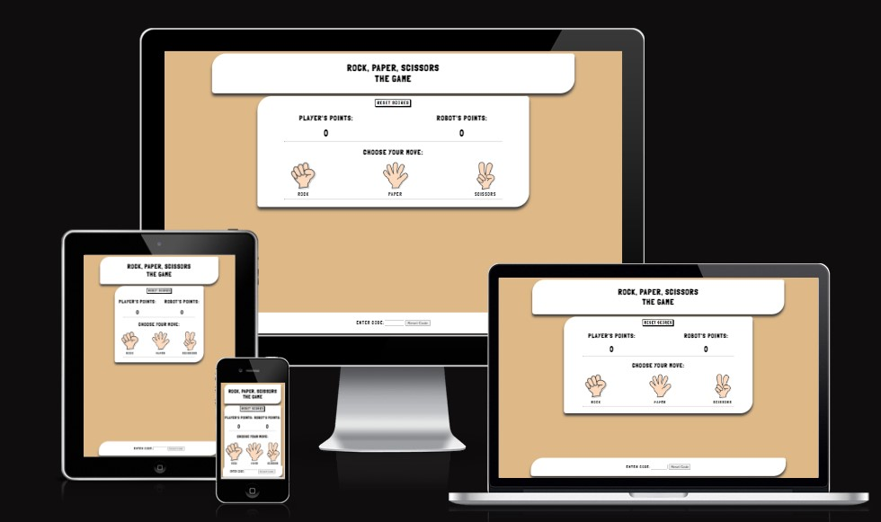
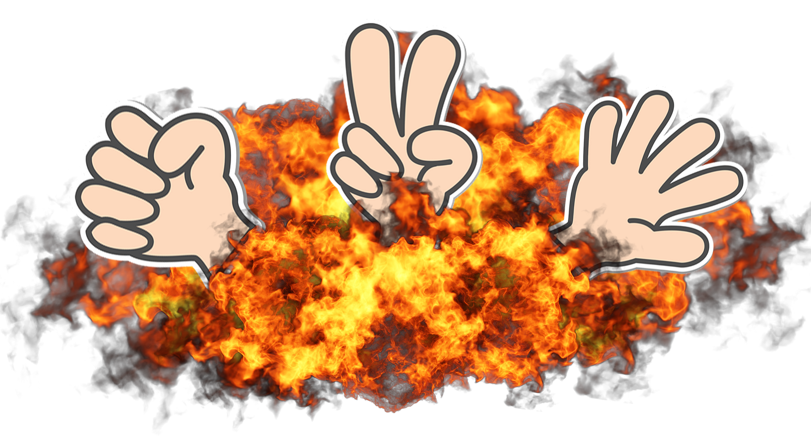

# Rock, Paper, Scissors - The Game

## Second project at Code Institute

Rock, Paper, Scissors - The Game is constructed to show the use of my knowledge with JavaScript. Together with my skills in HTML and CSS. This is a god old classic game called Rock, Paper, Scissors. The basic is to use one of the elements in order to beat another. Where Rock always beat Scissors, Scissors always beat Paper, and Paper alwas beat Rock. In this game. A user can choose one of the options to play against the computer (the Robot). The Robot's choise is random using "Math.random()" in JavaScript.

# Table of Content

- <a href="#the-game">Rock, Paper, Scissors - The Game</a>
- <a href="#table-of-content">Table of Content</a>
- <a href="#demo">Demo</a>
- <a href="#user-experience">User Experience</a>
- <a href="#user-stories">User Stories</a>
  - <a href="#strategy">Strategy</a>
  - <a href="#scope">Scope</a>
  - <a href="#structure">Structure</a>
  - <a href="#skeleton">Skeleton</a>
  - <a href="#surface">Surface</a>
- <a href="#technologies">Technologies</a>
- <a href="#features">Features</a>
- <a href="#finalising">Finalising</a>
- <a href="#more-features">More Features</a>
- <a href="#testing">Testing</a>
  - <a href="#bugs">Bugs</a>
- <a href="#deployment">Deployment</a>
- <a href="#credits">Credits</a>
  - <a href="#acknowledgements">Acknowledgements</a>

# Demo

 

The live link can be found here - <a href="https://robertahlin.github.io/rps-project2b/" target="_blank">https://robertahlin.github.io/rps-project2b/</a>

The site will be developed to be responsive for different devices.

The idear for this project it to make a playable game against the computer. First there should be an landing page that will show a hero image about the game and that is also will containg intructions on how to play the game. And as every gamer always want to win there are an option to enter cheat code.

# User Experience

The user of this website should be able to try out the concept of playing Rock, Paper, Scissors and practice it against a robot. The game here is just based on luck.

## User stories

A visitor to the site should:

- Get a wow-feeling on the landing page.
- Understand the purpose of this website quickly and easily.
- Easily navigate this website.
- Play a game for fun.
- Get an understanding the Rock, Paper, Scissors game.
- Be able to enter cheat code to be always win.

### Strategy

The goal is to make a well-functioning interesting website. The focus was on making the design a fun, user-friendly and creative site.

### Scope

For the users that are interested in motocross and enduro. I want the site be informative. Somewhat educational but mostly be ablse to find information about me as rider. Content of images and videos will keep the visitor interested.

### Structure

I aimed for a simple website that should contain as little clicks as possible. Also as litte scrolling as possible. Even though it's quite easy to scroll up and down on a cell phone is still wanted it to be possible to get a quick overview of each page. If the visitor want to see more about me. I've provided easy accesed links to external social media platforms, such a Facebook, YouTube and instragram in the foooter.

**Website:**

1. **_Home / Index page:_** A logo for Robstar Racing and a video to catch interest for the user.
2. **_Images:_** Be able to view images of different events in the sports.
3. **_About:_** Information page about me and about motocross and enduro. As well as a form to subscribe to a newsletter.

### Skeleton

The website is designed to be clear and simple. And the site has a simple tree structure with hierarchical flows from top to bottom.

**Wireframe**

I started to draw couple of quick designs in paper. And this is the one I liked the most.

The basic idea is to have it simple with some small 3d effects. 

### Surface

First I though of a light blue background. But later I decided for a light yellow because I wanted to get it fell like sand. Because my favourite motocross tracks have a basis of sand.
So I went for rgb(255, 245, 191) that is easy to have behind text and it somewhat reminds me of sand. On top of that I wanted the feeling of some hovering boxes. I thought it felt quite boring with just sharp square boxes. So I went for a shaoe that I used like 20 years ago in a side business I had back in time.

## Technologies

1. HTML - To create a basic site
2. CSS - To create a nice, standout front-end with a feel of 3d and shading.

## Features

Existing Features
Navigation Bar

Featured on all pages, the full responsive navigation bar should be centered with equal space between to follow the different sceen widths. Three links to Home, an image libaray and to an about page. This should look the same on all pages.
The navigation links should always be visible to minimize the amount of clicking but also big enough to be able to use with a finger on a cell phone.
This section will allow the user to easily navigate from page to page across all devices without having to revert back to the previous page via the browser's ‘back’ button.

A really cool hero image: 
 
Something eye catching on the page to make the visitor interested.

The first basic structure for the game looks like this: 
 
This will be the main theme for all pages and will be added with contents.

I really liked the idea of the footer from the Love Runing project. So I used that knowledge from that and made it fit my design. 
 
This will ensure that the visitor can find other media quick and easy if they wish to get more information or wants to follow me in any social media.
I made the links work to my Facebook page, YouTube and Instagram. I made them open in new windows. But beware, the pages are in Swedish.

Also the gallery idea from the Love running project was a nice feature. Especially the feature that made the image sort up in more columns
the wider the screen gets. This gives a great view over the images and works good on any screen with.

In the about page I wanted the visitor to be able to read some about me and what's the different between motocross and enduro.
I can write a lot about but I think the content is enough for now.

## Finalising

Finally after some time I started to feel satisfied with a good site: 

 
This is the view from a Samsung Galaxy S8+, but I've been working a lot with different sceeen sizes and in responsive mode to confirm that it will work on
all devices.

## More Features?

Of course I want to add more things.
<ul>
<li> One image gallery so it will be one for motocross and one for enduro.</li>
<li> Thinking of adding a page only for videos</li>
<li> I was looking for a way to make the images clickable to view them on 100% width. But I didn't find anything that was working good enough to my liking. After spending a couple of hour on it, I decided to skip it for now and look for a solution later.</li>
</ul>

## Testing

In contrast to the first project. I continuesly tested the code along to with coding to make sure everything is ok.

Some things that come up is to add a header to each section in the html code. In order to 

The CSS Validator gave me two errors. One that I had forgot to write a unit on a margin. And the second one was that I had typed "position; bottom;"
which I changed to "position; fixed;".

Links to the validation
<ul>
<li> HTML of <a href="https://validator.w3.org/nu/?doc=https%3A%2F%2Frobertahlin.github.io%2Fmotocross-in-action%2Findex.html" target="_blank">index</a> page.</li>
<li> HTML of <a href="https://validator.w3.org/nu/?doc=https%3A%2F%2Frobertahlin.github.io%2Fmotocross-in-action%2Fimages.html" target="_blank">images</a> page.</li>
<li> HTML of <a href="https://validator.w3.org/nu/?doc=https%3A%2F%2Frobertahlin.github.io%2Fmotocross-in-action%2Fabout.html" target="_blank">about</a> page.</li>
<li> CSS of <a href="https://jigsaw.w3.org/css-validator/validator?uri=https%3A%2F%2Frobertahlin.github.io%2Fmotocross-in-action%2Fassets%2Fcss%2Fstyle.css&profile=css3svg&usermedium=all&warning=1&vextwarning=&lang=en" target="_blank">style.css</a>.</li>
</ul>

Other than the validators. I've been using the Inspect view in Google Crome using different layout for different devices and a lot with the responsive layout.
I also tested the webside through my iPhone.
I've tested the website on a PC using Chrome and Edge web browsers.
Also my mentor have tested the website.

### Bugs?

Yes, when using different screen sizes and espicially the responsive view in the browser. The "header", "main" and "footer" section doesn't line to the right margin of the view. It looks good on a mobile, but the wider screen is, the worse it looks. I have tried with various widths, margins and paddings without success. I tried to search the internet without any help. The last thing I noticed was that it seems to be affected by the "z-index" value. The higher value the more close it is to the right edge. Couln't solve it or even if might not be able to solve? Is that the purpose of "z-index"?
After struggeling with it for some time I kind of started over with the whole website and "cleaned" the code from start and tried to see when the effect occured. Finally I found a solution for it.

## Deployment

<ul>
<li>The site was deployed to GitHub pages. The steps to deploy are as follows:</li>
<ul>
<li>In the GitHub repository, navigate to the Settings tab</li>
<li>From the source section drop-down menu, select the Master Branch</li>
<li>Once the master branch has been selected, the page will be automatically refreshed with a detailed ribbon display to indicate the successful deployment.</li>
</ul>
</ul>

## Credits

<ul>
<li>For this project I want to credit the Google search engine. It's hard to remember how to write all codes.</li>
<li>A lot of help comes from search hist at the "stack overflow" forums.</li>
<li>Hand images of rock, paper and scissors from: <a href="https://www.pngaaa.com/detail/3313784" target="_blank">https://www.pngaaa.com/detail/3313784</a></li>
<li>Image of explostion from <a href="https://www.vecteezy.com/png/9374808-fire-explode-png-design">https://www.vecteezy.com/png/9374808-fire-explode-png-design</a></li>
</ul>

Other that that:
All the text are authored by me.

### Acknowledgements

- Ideas were taken from the Code Institute's Love Running project.
- The the Code Institute Student Care for helping me postpone my project deadline, due to a family member passed away just when I was about to start, my project. And I had just set my life on hold a couple of days.
- My mentor, Medale Oluwafemi, for hes great suggestions and quick help.
