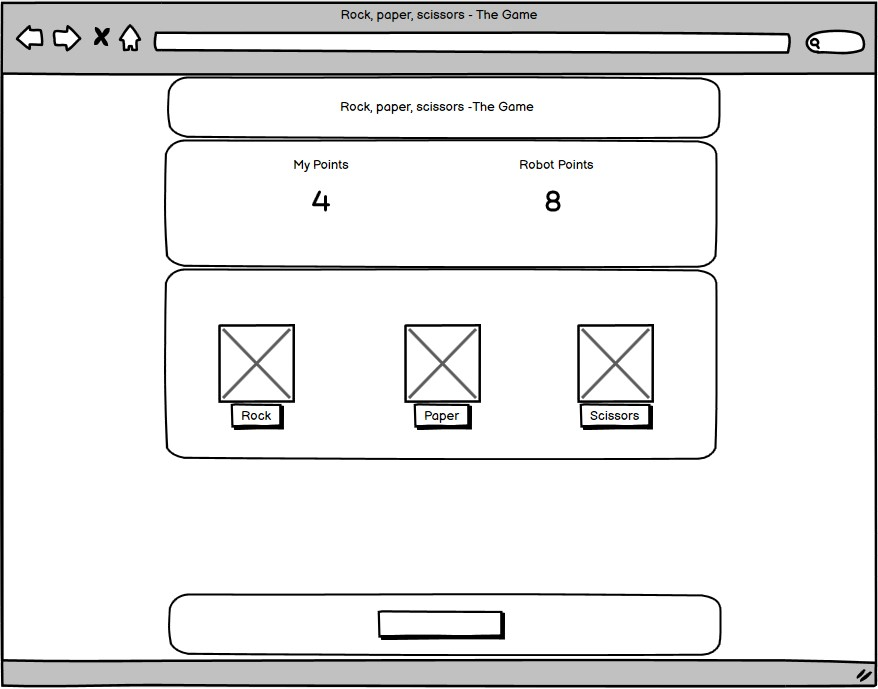
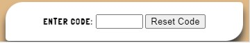
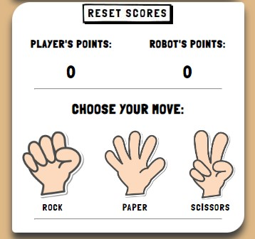
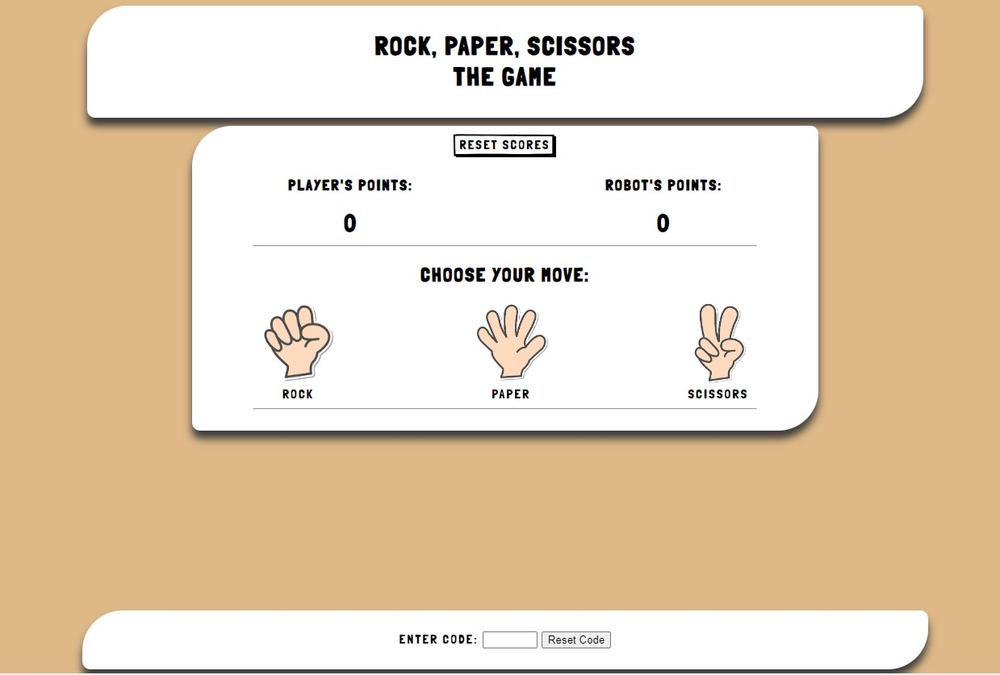
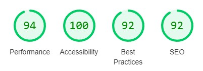

# Rock, Paper, Scissors - The Game

## Second project at Code Institute

Rock, Paper, Scissors - The Game is constructed to show the use of my knowledge with JavaScript. Together with my skills in HTML and CSS. This is a good old classic game called Rock, Paper, Scissors. The basics is to use one of the elements in order to beat another. Where Rock always beat Scissors, Scissors always beat Paper, and Paper always beat Rock. In this game. A user can choose one of the options to play against the computer (the Robot). The Robot's choice is random using "Math.random()" in JavaScript.

# Table of Content

- <a href="#the-game">Rock, Paper, Scissors - The Game</a>
- <a href="#table-of-content">Table of Content</a>
- <a href="#demo">Demo</a>
- <a href="#user-experience">User Experience</a>
- <a href="#user-stories">User Stories</a>
  - <a href="#strategy">Strategy</a>
  - <a href="#scope">Scope</a>
  - <a href="#structure">Structure</a>
  - <a href="#skeleton">Skeleton</a>
  - <a href="#surface">Surface</a>
- <a href="#technologies">Technologies</a>
- <a href="#features">Features</a>
- <a href="#finalising">Finalising</a>
- <a href="#more-features">More Features</a>
- <a href="#testing">Testing</a>
  - <a href="#bugs">Bugs</a>
- <a href="#deployment">Deployment</a>
- <a href="#credits">Credits</a>
  - <a href="#acknowledgements">Acknowledgements</a>

# Demo

 

The live link can be found here - <a href="https://robertahlin.github.io/rps-project2b/" target="_blank">https://robertahlin.github.io/rps-project2b/</a>

The site is developed to be responsive for different devices.

The idea for this project it to make a playable game against the computer. But first there is a landing page that will show a hero image for the game and it will also contain instructions on how to play the game. And as every gamer always want to win, there are an option to enter cheat code.

Use "godmode" as code to try it out. (Without the "".)

# User Experience

The user of this website should be able to try out the concept of playing Rock, Paper, Scissors and practice it against a robot. The game here is just based on luck.

## User stories

A visitor to the site should:

- Get a wow-feeling on the landing page and get interested to try the game.
- Understand the purpose of this website quickly and easily.
- Easily navigate the website.
- Play a game for fun.
- Get an understanding the Rock, Paper, Scissors game.
- Be able to enter cheat code to be able to always win.

### Strategy

The goal is to make a well-functioning interesting website. The focus was on making the design a fun, user-friendly and creative site.

### Scope

For the purpose to show my knowledge in JavaScript, as well as doing something fun. And also add something different like thinking outside the box with the possibility to enter cheat code.

### Structure

I aimed for a simple website that should contain as little clicks as possible. Also as little scrolling as possible. Even though it's quite easy to scroll up and down on a cell phone I still wanted it to be possible to get a quick overview of the game. I wanted to minimize the usage of Media Queries and have a responsive site by using precent in widths etc.

**Website:**

1. **_Home / Index page:_** Landing page with a hero image. Link to play page and some instructions included.
2. **_Game:_** The game area with clickable images to play.

### Skeleton

The website is designed to be clear and simple. And the site has a simple tree structure with hierarchical flows from top to bottom.

**Wireframe**

For this project I tried the Balsamic to scetch a layout. 

The basic idea is to have it simple with some small 3d effects. 
I liked the theme I had in my first project with the rounded corners with different areas.

### Surface

I was first thinking of to have a background color as the shade of a human skin. But as the skin can really vary in color I decided for "burlywood" after been trying out a couple of colors.
I wanted the page to feel warm and light. So the combination of the burlywood color and the white "clouds" I think I achieved that.

## Technologies

1. HTML - To create a basic site
2. CSS - To create a nice, standout front-end with a feel of 3d and shading.
3. JavaScript to handle all the mechanics.

## Features

Existing Features
- Navigation Bar

There is a small navigation bar on the index page. I didn't want another page for the instructions so I made a hidden div that toggles hidden and shown when clicking the Instructions link.
The navigation bar on the game page contains a link back to index page.

A really cool hero image: 
 
Something eye catching on the page to make the visitor interested.
I  used some skills in Photoshop to make the image.

The first basic structure for the game looks like this: 
 
This will be the main theme for all and will be added with contents.

My design theme fits well to use a footer. In the footer I placed the ability to enter code. 
 
It feels like a good place to have the cheat code area. It doesn't interfere with the game design but still it available.

The game area. I wanted it to be simple. At first, I made it possible to first choose what move to play and then click a Play button to start. But after discussion with my mentor, I changed it, so the game starts as soon as the player click a hand. And then a one second wait timer to simulate that the robot is thinking. The score will increase by one up to ten to determine the winner. Then the game has to be restarted by clicking the reset score button. 

## Finalising

 
 
I've been using the responsive layout a lot in inspect mode using Google Chrome.

## More Features?

A couple of things is in my mind.
<ul>
<li> The ability to go to next level if you win a round of ten points. Just for fun. The game can't be "harder" on a higher level. :-D</li>
<li> Adding more codes for different features.</li>
</ul>

## Testing

In contrast to the first project. I continuously tested the code along to with coding to make sure everything is ok.

Some things that come up is to add a header to each section in the html code. But I later changed the sections and just had one header added.

The CSS Validator gave me two errors. One that I had forgot to write a unit on a margin. And the second one was that I had typed "position; bottom;"
which I changed to "position; fixed;".

I also used Lighthouse in Chrome to find ways to increase the accessibility of the website. 
 

Links to the validation
<ul>
<li> HTML of <a href="https://validator.w3.org/nu/?doc=https%3A%2F%2Frobertahlin.github.io%2Frps-project2b%2Findex.html" target="_blank">index</a> page.</li>
<li> HTML of <a href="https://validator.w3.org/nu/?doc=https%3A%2F%2Frobertahlin.github.io%2Frps-project2b%2Fgame.html" target="_blank">game</a> page.</li>
<li> CSS of <a href="https://jigsaw.w3.org/css-validator/validator?uri=https%3A%2F%2Frobertahlin.github.io%2Frps-project2b%2Fassets%2Fcss%2Fstyle.css&profile=css3svg&usermedium=all&warning=1&vextwarning=&lang=en" target="_blank">style.css</a>.</li>
<li> To validate my JavaScript I  used <a href="https://jshint.com/" target="_blank">https://jshint.com/</a>. (Couldn't find a way to post links, directly to the JavaScript file.)</li>
</ul>

Other than the validators. I've been using the Inspect view in Google Crome using different layout for different devices and a lot with the responsive layout.
I also tested the website through my iPhone.
I've tested the website on a PC using Chrome and Edge web browsers.
Also, my mentor has tried the website.

### Bugs?

<ul>
<li>There is something with the "swap image function" when clicking the "Reset scores" button. Sometimes it doesn't swap to the "down button image". After hard refreshing the page a couple of times it works. Sometimes it works when holding down the mouse button for a while. It also seems to work better in Microsoft Edge.</li>
<li>Also the swap image function doesn't seem to respond when in inspect mode in Google Chrome.
<li>The toggle of div containing the instructions on the index page don't work when the script is in the script.js file. I had to place it in another file called index-script.js. I discovered that if I placed it first in the script.js document it worked, but then the swap image effect on the "Reset Score" button stopped working completely. I couldn't figure out why. So the solutions was to have them in different files.</li>
</ul>

## Deployment

<ul>
<li>The site was deployed to GitHub pages. The steps to deploy are as follows:</li>
<ul>
<li>In the GitHub repository. I navigated to the Settings tab</li>
<li>From the source section drop-down menu, I selected the Master Branch</li>
<li>Once the master branch was selected and saved, I had to go out from the page and back in in order to load the link.</li>
</ul>
</ul>

## Credits

<ul>
<li>For this project I want to credit the Google search engine. It's hard to remember how to write all codes.</li>
<li>A lot of help comes from search hits at the "stack overflow" forums.</li>
<li>Ideas and some code from my previous project <a href="https://robertahlin.github.io/motocross-in-action/" target="_blank">Motocross in action</a>.</li>
<li>Hand images of rock, paper and scissors from: <a href="https://www.pngaaa.com/detail/3313784" target="_blank">https://www.pngaaa.com/detail/3313784</a></li>
<li>Image of explosion from <a href="https://www.vecteezy.com/png/9374808-fire-explode-png-design">https://www.vecteezy.com/png/9374808-fire-explode-png-design</a></li>
</ul>

Other that that:
All the text are authored by me.

### Acknowledgements

- My mentor, Medale Oluwafemi, for great suggestions and help and for showing how use document tags at <a href="https://jsdoc.app/about-getting-started.html" target="_blank">https://JSDoc.app</a>
